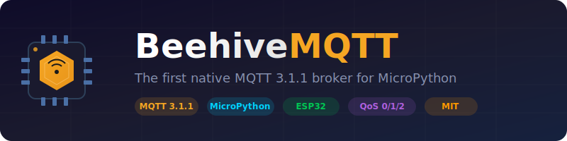

<p align="center">
  
</p>

<p align="center">
  <strong>The first native MQTT 3.1.1 broker for MicroPython</strong>
</p>

<p align="center">
  <a href="#quick-start">Quick Start</a> &bull;
  <a href="#usage-examples">Examples</a> &bull;
  <a href="#architecture-overview">Architecture</a> &bull;
  <a href="#configuration">Configuration</a> &bull;
  <a href="docs/api.md">API</a> &bull;
  <a href="CONTRIBUTING.md">Contributing</a>
</p>

<p align="center">
  
  
  
  
  
  
</p>

---

BeehiveMQTT is the first and only native MQTT 3.1.1 broker for MicroPython, running directly on ESP32/RP2040 microcontrollers without requiring external infrastructure. Perfect for edge computing, IoT gateways, and distributed sensor networks.

<p align="center">
  
</p>

## Quick Start

Get a basic MQTT broker running in just three lines:

```python
from beehivemqtt import BeehiveBrokerSimple
broker = BeehiveBrokerSimple(port=1883)
broker.run()
```

## Installation

### Using mip (Recommended)

```python
import mip
mip.install("github:mateuszsury/BeehiveMQTT")
```

### Manual Installation

1. Download the `beehivemqtt` directory
2. Copy it to your MicroPython device's filesystem:
   ```bash
   mpremote cp -r beehivemqtt :
   ```

### As Frozen Module

For maximum performance, compile BeehiveMQTT as a frozen module into your MicroPython firmware. This reduces memory usage and improves startup time.

## Usage Examples

### Basic Broker

```python
from beehivemqtt import BeehiveBrokerSimple

# Start a simple broker on port 1883
broker = BeehiveBrokerSimple(port=1883)
broker.run()
```

### With Authentication

```python
from beehivemqtt import MQTTBroker, BrokerConfig, DictAuthProvider

try:
    import asyncio
except ImportError:
    import uasyncio as asyncio

# Configure authentication
auth = DictAuthProvider({
    "user1": "password123",
    "sensor_node": "secret456"
})

config = BrokerConfig(port=1883, allow_anonymous=False)
broker = MQTTBroker(config=config, auth=auth)

asyncio.run(broker.serve())
```

### With Event Hooks

```python
from beehivemqtt import MQTTBroker, BrokerConfig

try:
    import asyncio
except ImportError:
    import uasyncio as asyncio

config = BrokerConfig(port=1883)
broker = MQTTBroker(config=config)

@broker.on_connect
def handle_connect(client_id, username, will_topic):
    print("Client connected: %s" % client_id)

@broker.on_publish
def handle_publish(client_id, topic, payload, qos, retain):
    print("Published: %s from %s" % (topic, client_id))

asyncio.run(broker.serve())
```

### With Access Control Lists (ACL)

```python
from beehivemqtt import MQTTBroker, BrokerConfig, ACLAuthProvider

try:
    import asyncio
except ImportError:
    import uasyncio as asyncio

# Create ACL auth provider and add users with roles
auth = ACLAuthProvider()
auth.add_user('sensor_node', 'pass1', role='sensor')
auth.add_user('controller', 'pass2', role='controller')

# Define ACL rules per role
auth.add_acl('sensor', 'sensors/#', publish=True, subscribe=False)
auth.add_acl('sensor', 'commands/+', publish=False, subscribe=True)
auth.add_acl('controller', 'commands/#', publish=True, subscribe=True)
auth.add_acl('controller', 'sensors/#', publish=False, subscribe=True)

config = BrokerConfig(port=1883, allow_anonymous=False)
broker = MQTTBroker(config=config, auth=auth)

asyncio.run(broker.serve())
```

## Configuration

The `BrokerConfig` class provides comprehensive configuration options:

| Parameter | Type | Default | Description |
|-----------|------|---------|-------------|
| `port` | int | 1883 | TCP port to bind the broker |
| `bind_addr` | str | "0.0.0.0" | Network interface to bind to |
| `max_clients` | int | 10 | Maximum concurrent client connections |
| `max_inflight` | int | 10 | Maximum in-flight QoS messages per client |
| `max_queued_messages` | int | 50 | Maximum queued messages per client |
| `max_packet_size` | int | 8192 | Maximum MQTT packet size in bytes |
| `max_payload_size` | int | 4096 | Maximum message payload size in bytes |
| `allow_anonymous` | bool | True | Allow unauthenticated connections |
| `retain_enabled` | bool | True | Enable retained message support |
| `qos2_enabled` | bool | True | Enable QoS 2 support |
| `sys_topics_enabled` | bool | True | Publish $SYS statistics topics |

See [docs/configuration.md](docs/configuration.md) for detailed configuration options.

## Architecture Overview

<p align="center">
  
</p>

BeehiveMQTT is designed with a modular architecture optimized for constrained devices:

| Layer | Modules | Responsibility |
|-------|---------|----------------|
| **Public API** | `broker.py`, `simple.py`, `config.py`, `errors.py` | User-facing classes and configuration |
| **Protocol Core** | `packet.py`, `router.py`, `qos.py`, `utils.py`, `ratelimit.py` | MQTT 3.1.1 packet handling and routing |
| **Services** | `auth.py`, `retained.py`, `stats.py`, `logging.py` | Authentication, retention, monitoring |
| **Data** | `session.py`, `topic.py` | Client state, topic trie with wildcards |

## Performance Estimates

Expected performance varies by hardware platform:

| Platform | Max Clients | RAM Usage | Flash Usage (.mpy) | Notes |
|----------|-------------|-----------|-------------------|-------|
| ESP32 (no PSRAM) | 5-8 | ~2-5KB per client | ~34KB | Limited by available heap |
| ESP32 (with PSRAM) | 100+ | ~2-5KB per client | ~34KB | Scales with external RAM |
| RP2040 | 3-5 | ~2-5KB per client | ~34KB | Limited to ~264KB total heap |

Performance factors:
- Message throughput: 100-500 msg/sec depending on QoS level
- Each active subscription uses ~50-100 bytes
- Retained messages consume heap memory proportional to payload size
- QoS 1/2 tracking requires additional memory per in-flight message

## Client Compatibility

BeehiveMQTT is compatible with standard MQTT 3.1.1 clients:

### Mosquitto Clients
```bash
# Subscribe
mosquitto_sub -h <device-ip> -t "sensors/#"

# Publish
mosquitto_pub -h <device-ip> -t "sensors/temperature" -m "22.5"
```

### Paho MQTT (Python)
```python
import paho.mqtt.client as mqtt

client = mqtt.Client()
client.connect("<device-ip>", 1883, 60)
client.publish("sensors/humidity", "65")
client.subscribe("commands/#")
```

### umqtt.simple (MicroPython)
```python
from umqtt.simple import MQTTClient

client = MQTTClient("client_id", "<device-ip>")
client.connect()
client.publish(b"sensors/temperature", b"23.1")
client.disconnect()
```

## Documentation

- [API Reference](docs/api.md) - Complete API documentation
- [Configuration Guide](docs/configuration.md) - Advanced configuration options
- [Protocol Implementation](docs/protocol.md) - MQTT 3.1.1 protocol compliance details

## Contributing

We welcome contributions! Please see [CONTRIBUTING.md](CONTRIBUTING.md) for guidelines on:
- Setting up your development environment
- Code style and testing requirements
- Submitting pull requests
- Reporting issues

## License

BeehiveMQTT is licensed under the MIT License. See [LICENSE](LICENSE) for the full license text.

---

<p align="center">
  
  <br/>
  <sub>Built with care for the MicroPython community</sub>
</p>
